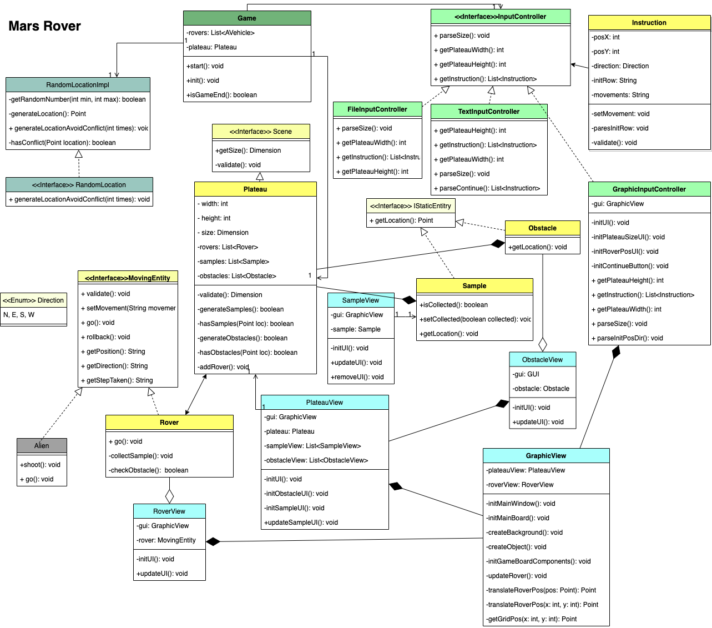

# Mars Rover New
## New version is a rewrite due to
1. consider unit test for single class instead of the unit test for the main class only
2. using validator to consolidate the validation code in single function
3. rename the class to proper name, eg. AVehicle change to MovingEntity
4. reconsider of using abstract class or interface (eg. InputController better use interface instead of Abstract class, as the similarities between different controller is not that strong)
5. use key event instead of mouse event for moving rover in graphic view for faster movement
6. But still unable to figure out the best way (has tried AssertJ but failed to click on button) to do GUI unit test for swing, may be move to JavaFX and try TestFX to do unit test

## Key Feature:
1. The game support 3 types of user controller, i.e.
   File input controller, Keyboard input controller, GUI input controller.
2. Player need to avoid hitting the boundary of plateau and obstacles to collect samples. The no. of samples and obstacles are the size of plateau / 10.

## UML diagram
## Class Diagram:


#### Flow of file input:
0. Run the FileInputMain to start the game
```
mvn compile exec:java -Dexec.mainClass="main.FileInputMain"
```
1. Player needs to provide a file which states the plateau size and initial position and direction of rovers and a set of instruction (L/R/M) for each rover (It supports mutliple rovers).
2. Program will base on plateau size to generate the samples for rover to collect and obstacles to block the ways of rover
3. The game will end after program process the instruction and then display the final location of the rovers and number of samples they collected.
4. If any step hit the boundary of plateau or hit the obstacle. Exception will throw and halt the program.

#### Flow of keyboard input:
0. Run the TextInputMain to start the game
```
mvn compile exec:java -Dexec.mainClass="main.TextInputMain"
```
1. The game will ask user to input the plateau size and initial position and direction of rover. (It supports multiple rovers.)
2. Program will base on plateau size to generate the samples for rover to collect and obstacles to block the ways of rover
3. The game will then display the locations of samples / obstacles.
4. Player can then input the instruction (L/R/M) in one line to control the rover path.
5. The game will end after program display final location of the rover and number of samples collected.
6. If any step hit the boundary of plateau or hit the obstacle. Exception will throw and halt the program.

#### Flow of GUI input:
0. Run the GrahpicInputMain function to start the game
```
mvn compile exec:java -Dexec.mainClass="main.GraphicInputMain"
```
1. The game will ask user to input the plateau size and initial position and direction of rover. (It supports one rover only.)
2. Then the game will display the locations of samples / obstacles in the plateau.
3. Player can then input the instruction (L/R/M) by keypress to control its path.
4. When the rover collect the samples, it will show the number of samples collected.
5. If any step hit the boundary of plateau or hit the obstacle. A message will show and ask user to re-input.
6. If all the samples are collected, the game will end.

## Assumptions
#### For File input:
1. There will be 1 row at the top to indicate the screen size.
2. And then 1 row for specifying each rover init location and direction.
   Init location x, y are integers and should be within the plateau. And direction accepts N,E,S,W only.
3. And then 1 row for specifying each rover movements. It accepts a line of L,R,M combination only.
4. 2,3 will be repeated if there are more rovers
5. The program will calculate the final location of rover and display.
6. If the rover hit the boundary, the program will throw exception and quit.
7. If the rover hit the obstacles, the program will throw exception and quit.
8. If the rover enter the box with samples, rover will collect the samples, the count will be shown.
9. Game will end after program process the file and calculated the final location and no. of samples collected.

#### For Keyboard Input:
1. First, the text UI will ask for plateau width and height. They must be integers.
2. Second, the text UI will ask for rover initial position. They must be integers too and should be within the plateau.
3. Thirdly, the text UI will ask for rover initial direction. Direction must be N,E,S,W.
4. If any of the above input not valid, the program will halt.
5. The program will calculate the final location of rover and display.
6. If the rover hit the boundary, the program will throw exception and halt.
7. If the rover hit the obstacles, the program will throw exception and halt.
8. If the rover enter the box with samples, rover will collect the samples, the count will be shown.

#### For GUI controller:
Since the screen is limited to 800x600, the plateau size can only support up to 15x9.
1. First screen show a parameter request form to ask for plateau size and initial position / direction of rover.
2. Validation of plateau size are 15x9.
3. Validation of rover initial position x and y are integers and within the plateau size.
4. Validation of rover direction must be N,E,S,W
5. User needs to key in L/R/M to control rover to move.
6. If the rover hit the boundary, the program will show error message. User can give instruction again.
7. If the rover hit the obstacles, the program will show error message. User can give instruction again.
8. If the rover enter the box with samples, rover will collect the samples, the count will be shown in the message box.
9. Game will end after all samples are collected.

## Approaches
1. Create Plateau class
2. Validate for non-integer, 0, negative size, null, throws exception if not pass the validation
3. Create Rover class
4. Validate for non-integer, 0, negative size, null init-position
5. Validate for non-NESW direction
6. Read file input
7. Parse the input to see if the file contains correct no. of parameter each line
8. Check rover collision for multiple rovers case
9. Create Sample class
10. Update rover to collect the sample
11. Create Obstacle class 
12. Update rover to consider obstacle 
13. Create text input controller and test it with exisiting logic
14. Create Graphic view controller and test it with existing logic

## Future thoughts
1. Implement GUI in Java FX
2. To support sizeable screen and sizeable image. So the gui plateau size does not bound to be 15x9.
3. Add background music, eg. star war music?!
4. Add feature to allow user to choose other vehicles, eg. flying scotsman
5. Add aliens to catch the rover, if rover is caught, then game over.

## Copyright
<a href="https://www.vecteezy.com/free-vector/mars-surface">Mars Surface Vectors by Vecteezy</a>
<a href="https://www.flaticon.com/free-icons/rock" title="rock icons">Rock icons created by Freepik - Flaticon</a>
<a href="https://www.flaticon.com/free-icons/mars-rover" title="mars-rover icons">Mars-rover icons created by Eucalyp - Flaticon</a>
<a href="https://www.flaticon.com/free-icons/mineral" title="mineral icons">Mineral icons created by Freepik - Flaticon</a>
<a href="https://pixabay.com/vectors/arrow-go-icon-icons-matt-next-1294468/">Arrow image by Pixabay </a>
<a href="https://www.vecteezy.com/free-vector/steam-train">Steam Train Vectors by Vecteezy</a>
